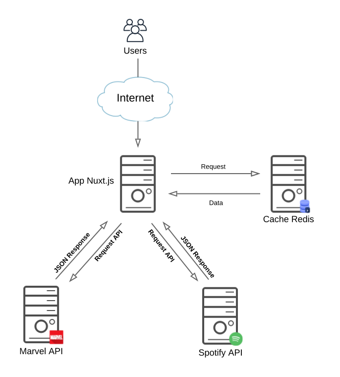

# Nuxt.js Spotify-Marvel

[](https://travis-ci.org/dejaneves/nuxtjs-spotify-marvel)

> My dazzling Nuxt.js project

## [Exemplo da aplicação rodando](https://nuxtjs-spotify-marvel.herokuapp.com/)

## Porque escolhi o Nuxt.js ?

Eu necessitava de um framework que me desse a flexibilidade para trabalhar nas duas layers (Front-End e Back-End). O Nuxt.js foi uma das muitas alternativas que encontrei para o meu propósito, eu o escolhi pela facilidade que o mesmo oferece na integração das duas camadas.

### Vue.js

O Vue.js veio como consequência, o client (Front-End) do Nuxt.js trabalha com ele, e que por sinal é uma excelente tecnologia para desenvolvimento Front-End.

### Library de Componentes Front-End

Para os componentes da aplicação foram usados o **Bootstrap** e **Bootstrap-vue**.

### Cache

Para realizar o cache da aplicação foi usado o [REDIS](https://redis.io/download).

### DevOps

Foram usadas algumas ferramentas de DevOps como o **Travis.CI** para integração contínua, e o **Heroku** como plataforma Cloud onde roda a aplicação.

## Configurações

Arquivo `.env`

Caso você queira, pode configurar o arquivo `.env`.

``` bash
# SPOTIFY
SPOTIFY_CLIENT_ID=<SPOTIFY_CLIENT_ID>
SPOTIFY_CLIENT_SECRET=<SPOTIFY_CLIENT_SECRET>
CLIENT_URL=<CLIENT_URL>
REDIS_URL=<REDIS_URL>

# MARVEL
MARVEL_BASEURL=<MARVEL_BASEURL>
MARVEL_KEY=<MARVEL_KEY>
MARVEL_HASH=<MARVEL_HASH>
```

| Key   | Descrição |
|----------|-------------|
| CLIENT_URL | **HOST** onde a aplicação está rodando |
| REDIS_URL | **HOST** servidor REDIS |

Caso você queira instalar um servidor **Redis** para teste.

```bash
$ cd ../
$ wget http://download.redis.io/releases/redis-5.0.3.tar.gz
$ tar xzf redis-5.0.3.tar.gz
$ cd redis-5.0.3
$ sudo make install
```

### Diagrama



### Executando a Aplicação

```bash

# project clone
$ git clone https://github.com/dejaneves/nuxtjs-spotify-marvel.git
$ cd nuxtjs-spotify-marvel.git

# install dependencies
$ npm install

# serve with hot reload at localhost:3000
$ npm run dev

# build for production and launch server
$ npm run build
$ npm start

# generate static project
$ npm run generate
```

For detailed explanation on how things work, checkout [Nuxt.js docs](https://nuxtjs.org).

## Tabela de Tecnologias Usadas

| Tecnologia   | Descrição |
|----------|-------------|
| [Nuxt.js](https://nuxtjs.org/) | Isomorphic Framework |
| [Vuejs](https://vuejs.org/) | JavaScript Framework |
| [Bootstrap-vue](https://bootstrap-vue.js.org/) | Componentes Front-End |
| [Bootstrap](https://getbootstrap.com/) | Componentes Front-End |
| [REDIS](https://redis.io/download) | Cache |
| [Heroku](https://www.heroku.com/) | Cloud Platform |
| [Travis.CI](https://travis-ci.org/) | Continuos Integration |
